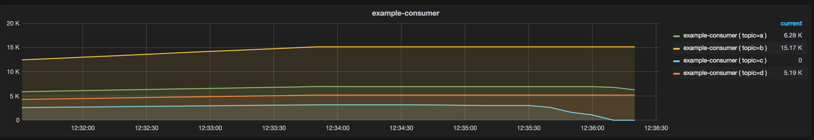

# Remora Fetcher



The [Remora Fetcher](https://github.com/imduffy15/remora-fetcher) fetches consumer group descriptions from [Remora](https://github.com/zalando-incubator/remora) and ingests the data into [KariosDB](https://kairosdb.github.io/)

```
$ ./remora-fetcher.py -h
usage: remora-fetcher.py [-h] [-k KAIROSDB_API] [-r REMORA_API]
                         [-p POLL_INTERVAL] [-d]

Fetches events from Remora and ingests it into KairosDB.

optional arguments:
  -h, --help        show this help message and exit
  -k KAIROSDB_API   The URL of the KairosDB API, the default is
                    `http://localhost:8080`
  -r REMORA_API     The URL of the Remora API, the default is
                    `http://localhost:9000`
  -p POLL_INTERVAL  The poll interval in seconds, the default is 10
  -d                Enables debug messages

Example: remora-fetcher.py -r http://192.168.20.6:9000
```
